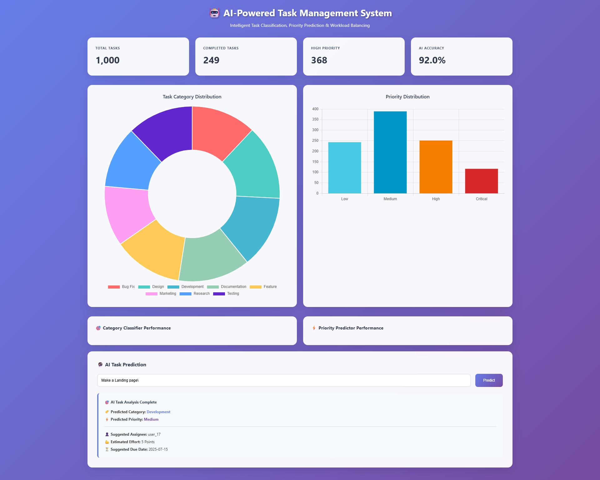

# 🤖 AI-Powered Task Management System


A full-stack intelligent task management system that leverages **Natural Language Processing (NLP)** and **Machine Learning (ML)** to automatically analyze, classify, and prioritize tasks. Built with a Python/Flask backend and a dynamic, responsive frontend.
> This project was developed during my **3-month internship at Infotact Solutions as a Data Science and Machine Learning Intern.**
> It was my first end-to-end AI project, where I applied NLP and ML techniques to build a fully functional AI-powered task management system.
The system accepts a simple task description and provides AI-driven insights including predicted category, priority level, suggested assignee, estimated effort, and due date.

---

## ✨ Live Demo Screenshot




---

## 🚀 Key Features

- 🔍 **AI-Powered Task Analysis**  
  End-to-end analysis from a single text input.

- 🗂️ **Automated Task Classification**  
  Uses an **SVM model** to categorize tasks like _Development_, _Bug Fix_, and _Design_.

- ⚡ **Intelligent Priority Prediction**  
  **Random Forest model** predicts task priority: _Low_, _Medium_, _High_, _Critical_.

- 💡 **Actionable Suggestions**  
  Recommends a random assignee, estimates effort (in points), and suggests a due date.

- 🌐 **Dynamic Frontend**  
  Single-page web app using vanilla **HTML/CSS/JS**; communicates with the backend via API.

- 🔌 **RESTful API**  
  Flask-based API to serve predictions and dashboard data.

- 🔄 **On-the-Fly Model Training**  
  Generates a synthetic dataset and retrains models every time the server starts — a full **MLOps demo**.

---

## 🛠️ Technology Stack

| Area     | Technologies |
|----------|--------------|
| Backend  | Python, Flask, Scikit-learn, Pandas, NumPy, NLTK |
| Frontend | HTML5, CSS3, Vanilla JavaScript, Chart.js |
| Tooling  | VS Code, Git, pip, venv |

---
## Dataset
### 📊 Dataset Information: tasks.csv
This project includes a sample synthetic dataset named tasks.csv, which contains 1,000 generated tasks. This dataset is created programmatically to simulate a realistic task management environment and serves as the foundation for training the AI models.
You can generate your own version of this dataset by running the generate_dataset.py script.
Dataset Generation Logic
#### Core Templates

Each of the 8 task categories (Development, Bug Fix, etc.) has a list of predefined, realistic task descriptions.

##### Rule-Based Priority

Task priority is determined by two factors:

- **Category Weighting**: Each category has a different probability of being high or low priority. For instance, a Bug Fix is more likely to be Critical than a Documentation task.
- **Keyword Detection**: Descriptions containing words like urgent, critical, or asap are automatically assigned a higher priority, mimicking real-world urgency.

##### Data Richness

Each task includes a full set of metadata, such as assignees, reporters, status, and realistic dates, to create a comprehensive dataset.

### Dataset Schema

The tasks.csv file contains the following columns:
| Column Name           | Data Type | Description                                                    | Example                                   |
| --------------------- | --------- | -------------------------------------------------------------- | ----------------------------------------- |
| `task_id`             | String    | A unique identifier for the task.                              | `TASK-0001`                               |
| `description`         | String    | The raw text describing the task. *(Input for Category Model)* | `Fix login authentication issue (urgent)` |
| `category`            | String    | The task category. *(Target for Category Model)*               | `Bug Fix`                                 |
| `priority`            | String    | The task priority. *(Target for Priority Model)*               | `Critical`                                |
| `assignee`            | String    | A randomly assigned user responsible for the task.             | `user_15`                                 |
| `reporter`            | String    | A randomly assigned user who reported the task.                | `user_4`                                  |
| `status`              | String    | The current status of the task.                                | `In Progress`                             |
| `created_date`        | String    | The date the task was created.                                 | `2025-05-15`                              |
| `due_date`            | String    | The expected completion date for the task.                     | `2025-05-22`                              |
| `effort_points`       | Integer   | An estimation of the work required (in story points).          | `13`                                      |
| `workload_percentage` | Integer   | A simulated current workload percentage for the assigned user. | `75`                                      |

## ⚙️ Local Setup & Installation

### 1. Prerequisites

- Python 3.9+
- pip
- Git

---

### 2. Clone the Repository

```bash
git clone https://github.com/[your-github-username]/AI-Task-Manager.git
cd AI-Task-Manager
```
### 3. Set Up Virtual Environment
```bash
# Create environment
python -m venv venv

# Activate (choose OS-specific)
# Windows
.\venv\Scripts\activate

# macOS/Linux
source venv/bin/activate
```
### 4. Install dependencies
```bash
pip install -r requirements.txt
```

### 5. Run the app.py
```bash
python app.py
```
> The server will start at: http://127.0.0.1:5000

## Project structure
```bash
AI-Task-Manager/
├── venv/                   # Virtual environment (excluded in .gitignore)
├── app.py                  # Main backend app with Flask & ML logic
├── requirements.txt        # Python dependencies
├── README.md               # This documentation
├── dashboard.png           # Dashboard screenshot
└── templates/
    └── index.html          # Frontend UI (HTML/CSS/JS)
```

